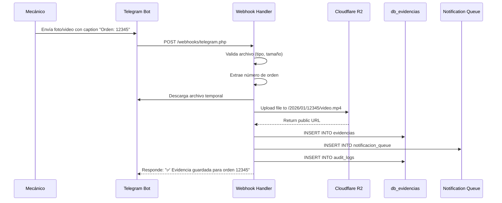
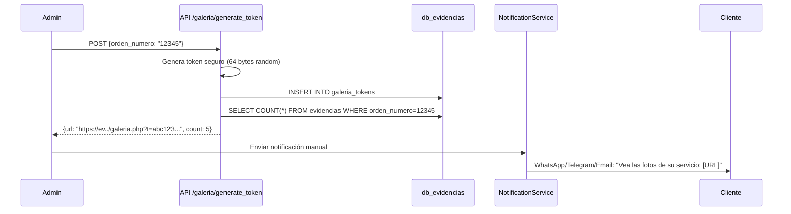
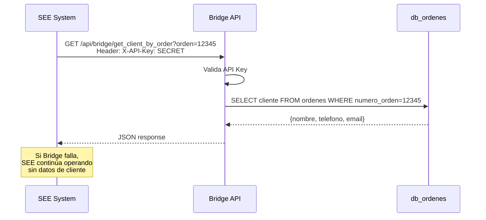

# Sistema de Evidencia ERR (SEE) - Documentación Técnica

## Descripción General

El **Sistema de Evidencia ERR (SEE)** es una aplicación independiente diseñada para gestionar evidencias fotográficas y de video de los servicios automotrices realizados en el taller. Opera de manera completamente desacoplada del sistema principal de gestión de órdenes (`taller-automotriz-app`) para garantizar alta disponibilidad y minimizar riesgos en producción.

**Dominio**: `see.errautomotriz.online`
**Stack Tecnológico**: PHP 8+, MariaDB, Cloudflare R2, Telegram Bot API

---

## Arquitectura del Sistema

### Principios de Diseño

1. **Independencia Total**: Base de datos separada (`db_evidencias`) sin acceso de escritura al sistema principal
2. **Comunicación Unidireccional**: SEE consulta datos del sistema principal mediante API read-only
3. **Resiliencia**: El sistema continúa operando aunque el sistema principal esté caído
4. **Seguridad por Diseño**: URLs firmadas, autenticación JWT, logs de auditoría

### Componentes

```
┌─────────────────────────────────────────────────────────┐
│                    Capa de Ingesta                       │
│  ┌────────────┐           ┌─────────────────┐          │
│  │ Telegram   │──Webhook─▶│ telegram.php    │          │
│  │ Bot        │           │ (Receiver)      │          │
│  └────────────┘           └─────────────────┘          │
└──────────────────────────┬──────────────────────────────┘
                           │
┌──────────────────────────▼──────────────────────────────┐
│                  Capa de Procesamiento                   │
│  ┌──────────────┐  ┌──────────────┐  ┌──────────────┐  │
│  │ R2Service    │  │ Thumbnail    │  │ Bridge       │  │
│  │ (Storage)    │  │ Service      │  │ Service      │  │
│  └──────────────┘  └──────────────┘  └──────────────┘  │
└──────────────────────────┬──────────────────────────────┘
                           │
┌──────────────────────────▼──────────────────────────────┐
│                   Capa de Persistencia                   │
│             ┌──────────────────────────┐                 │
│             │   db_evidencias          │                 │
│             │  (MariaDB)               │                 │
│             └──────────────────────────┘                 │
└──────────────────────────┬──────────────────────────────┘
                           │
┌──────────────────────────▼──────────────────────────────┐
│                  Capa de Presentación                    │
│  ┌──────────────┐           ┌──────────────────┐        │
│  │ Dashboard    │           │ Galería Cliente  │        │
│  │ (Admin)      │           │ (galeria.php)    │        │
│  └──────────────┘           └──────────────────┘        │
└─────────────────────────────────────────────────────────┘
```

---

## Estructura de Directorios

```
/home/nexus6/devs/see/
├── api/
│   ├── config/
│   │   ├── database.php          # Conexión a db_evidencias
│   │   ├── r2_config.php          # Credenciales Cloudflare R2
│   │   └── bridge_config.php      # Config API puente
│   ├── auth/
│   │   ├── login.php              # Autenticación JWT
│   │   ├── middleware.php         # Validación de tokens
│   │   └── validate_gallery_token.php
│   ├── evidencias/
│   │   ├── read.php               # Listar evidencias (admin)
│   │   ├── delete.php             # Eliminar evidencia (soft delete)
│   │   └── resend_notification.php
│   ├── galeria/
│   │   └── generate_token.php     # Generar URL segura de galería
│   └── audit/
│       └── logs.php               # Consultar logs de auditoría
├── services/
│   ├── R2Service.php              # Subida a Cloudflare R2
│   ├── ThumbnailService.php       # Generación de miniaturas
│   ├── BridgeService.php          # Consulta al sistema principal
│   └── NotificationService.php    # Envío multicanal
├── webhooks/
│   └── telegram.php               # Endpoint para Telegram Bot
├── cron/
│   └── process_notifications.php  # Procesamiento de cola
├── public/
│   ├── index.html                 # Landing page
│   ├── login.html                 # Login de administradores
│   ├── dashboard.html             # Panel administrativo
│   └── galeria.php                # Vista pública para clientes
├── assets/
│   ├── css/
│   │   └── styles.css
│   └── js/
│       ├── dashboard.js
│       └── gallery.js
├── database/
│   ├── schema.sql                 # Esquema completo de db_evidencias
│   └── seed.sql                   # Datos de prueba (opcional)
├── tests/                         # Pruebas unitarias e integración
├── docs/                          # Documentación adicional
│   ├── API.md                     # Documentación de endpoints
│   ├── TELEGRAM_SETUP.md          # Guía de configuración del bot
│   └── CLOUDFLARE_R2_SETUP.md     # Guía de configuración R2
├── composer.json                  # Dependencias PHP
└── README.md                      # Documentación principal
```

---

## Base de Datos

### Tablas Principales

#### `evidencias`
Almacena los registros de cada archivo multimedia subido.

```sql
CREATE TABLE evidencias (
    id INT AUTO_INCREMENT PRIMARY KEY,
    orden_numero VARCHAR(50) NOT NULL,
    archivo_path VARCHAR(500) NOT NULL,
    archivo_tipo ENUM('imagen', 'video') NOT NULL,
    archivo_nombre_original VARCHAR(255),
    thumbnail_path VARCHAR(500),
    telegram_file_id VARCHAR(255),
    telegram_message_id BIGINT,
    subido_por_usuario_id INT,
    fecha_creacion DATETIME DEFAULT CURRENT_TIMESTAMP,
    estado ENUM('activo', 'eliminado') DEFAULT 'activo',
    INDEX idx_orden (orden_numero),
    INDEX idx_fecha (fecha_creacion),
    FOREIGN KEY (subido_por_usuario_id) REFERENCES users(id) ON DELETE SET NULL
) ENGINE=InnoDB DEFAULT CHARSET=utf8mb4;
```

#### `users`
Sistema de autenticación independiente (no vinculado a taller-automotriz-app).

```sql
CREATE TABLE users (
    id INT AUTO_INCREMENT PRIMARY KEY,
    email VARCHAR(255) UNIQUE NOT NULL,
    password_hash VARCHAR(255) NOT NULL,
    rol ENUM('Admin', 'Recepcionista', 'Mecánico') DEFAULT 'Mecánico',
    activo BOOLEAN DEFAULT TRUE,
    created_at DATETIME DEFAULT CURRENT_TIMESTAMP,
    updated_at DATETIME DEFAULT CURRENT_TIMESTAMP ON UPDATE CURRENT_TIMESTAMP
) ENGINE=InnoDB DEFAULT CHARSET=utf8mb4;
```

#### `galeria_tokens`
Tokens seguros para acceso a galerías de clientes.

```sql
CREATE TABLE galeria_tokens (
    id INT AUTO_INCREMENT PRIMARY KEY,
    token_hash VARCHAR(64) UNIQUE NOT NULL,
    orden_numero VARCHAR(50) NOT NULL,
    expira_en DATETIME NOT NULL,
    vistas_count INT DEFAULT 0,
    created_at DATETIME DEFAULT CURRENT_TIMESTAMP,
    INDEX idx_token (token_hash),
    INDEX idx_orden (orden_numero)
) ENGINE=InnoDB DEFAULT CHARSET=utf8mb4;
```

#### `audit_logs`
Registro de auditoría para cumplir con RF-9.

```sql
CREATE TABLE audit_logs (
    id INT AUTO_INCREMENT PRIMARY KEY,
    usuario_id INT,
    accion ENUM('upload', 'delete', 'view', 'send_notification') NOT NULL,
    entidad_tipo VARCHAR(50),
    entidad_id INT,
    detalles JSON,
    ip_address VARCHAR(45),
    user_agent TEXT,
    timestamp DATETIME DEFAULT CURRENT_TIMESTAMP,
    FOREIGN KEY (usuario_id) REFERENCES users(id) ON DELETE SET NULL,
    INDEX idx_usuario (usuario_id),
    INDEX idx_timestamp (timestamp)
) ENGINE=InnoDB DEFAULT CHARSET=utf8mb4;
```

#### `notificacion_queue`
Cola de notificaciones con reintentos automáticos.

```sql
CREATE TABLE notificacion_queue (
    id INT AUTO_INCREMENT PRIMARY KEY,
    orden_numero VARCHAR(50) NOT NULL,
    tipo ENUM('whatsapp', 'telegram', 'email') NOT NULL,
    destinatario VARCHAR(255) NOT NULL,
    mensaje TEXT,
    galeria_url TEXT,
    estado ENUM('pendiente', 'enviado', 'fallido') DEFAULT 'pendiente',
    intentos INT DEFAULT 0,
    ultimo_error TEXT,
    created_at DATETIME DEFAULT CURRENT_TIMESTAMP,
    updated_at DATETIME DEFAULT CURRENT_TIMESTAMP ON UPDATE CURRENT_TIMESTAMP,
    INDEX idx_estado (estado),
    INDEX idx_orden (orden_numero)
) ENGINE=InnoDB DEFAULT CHARSET=utf8mb4;
```

---

## Flujos de Trabajo

### Flujo 1: Recepción de Evidencia vía Telegram



### Flujo 2: Generación de Galería para Cliente



### Flujo 3: Consulta al Sistema Principal (Bridge)



---

## Seguridad

### Autenticación de Administradores

**Método**: JSON Web Tokens (JWT)

**Flujo**:
1. Usuario ingresa email y contraseña en `/login.html`
2. POST a `/api/auth/login.php`
3. Backend valida contra tabla `users`
4. Si válido, genera JWT con payload:
   ```json
   {
     "user_id": 1,
     "email": "admin@errautomotriz.online",
     "rol": "Admin",
     "exp": 1736987654  // 24 horas
   }
   ```
5. Token se guarda en `localStorage`
6. Cada request incluye header: `Authorization: Bearer <token>`

### Protección de Galería de Clientes

**Método**: Tokens criptográficamente seguros con hash

**Implementación**:
```php
// Generación
$token = bin2hex(random_bytes(32));  // 64 caracteres hex
$tokenHash = hash('sha256', $token);
// Guardar $tokenHash en DB

// Validación
$hashFromRequest = hash('sha256', $_GET['t']);
// Query: SELECT * FROM galeria_tokens WHERE token_hash = $hashFromRequest
```

**Características**:
- Token de 64 caracteres (2^256 posibilidades)
- Expiración configurable (default: 30 días)
- Contador de vistas
- No reutilizable entre órdenes

### Validación de Archivos

```php
// Whitelist de extensiones
$allowed = ['jpg', 'jpeg', 'png', 'mp4', 'mov'];

// Validación MIME type
$finfo = finfo_open(FILEINFO_MIME_TYPE);
$mimeType = finfo_file($finfo, $tempPath);
$validMimes = ['image/jpeg', 'image/png', 'video/mp4', 'video/quicktime'];

// Límite de tamaño
$maxSize = 100 * 1024 * 1024; // 100 MB
```

---

## Integración con Cloudflare R2

### Configuración

Archivo: `/api/config/r2_config.php`

```php
<?php
return [
    'version' => 'latest',
    'region' => 'auto',
    'endpoint' => 'https://<ACCOUNT_ID>.r2.cloudflarestorage.com',
    'credentials' => [
        'key' => 'R2_ACCESS_KEY_ID',
        'secret' => 'R2_SECRET_ACCESS_KEY'
    ],
    'bucket' => 'err-evidencias',
    'cdn_url' => 'https://cdn.errautomotriz.online'
];
```

### Uso del SDK de AWS

```php
use Aws\S3\S3Client;

$s3 = new S3Client([
    'version' => 'latest',
    'region' => 'auto',
    'endpoint' => $config['endpoint'],
    'credentials' => $config['credentials'],
    'use_path_style_endpoint' => true
]);

// Upload
$result = $s3->putObject([
    'Bucket' => 'err-evidencias',
    'Key' => '2026/01/12345/video.mp4',
    'SourceFile' => '/tmp/telegram_video.mp4',
    'ContentType' => 'video/mp4',
    'ACL' => 'public-read'  // Si el bucket permite acceso público
]);

// URL pública
$url = "https://cdn.errautomotriz.online/2026/01/12345/video.mp4";
```

### Organización de Archivos

```
Bucket: err-evidencias
├── 2026/
│   ├── 01/
│   │   ├── 12345/
│   │   │   ├── foto_motor_001.jpg
│   │   │   ├── foto_motor_001_thumb.jpg
│   │   │   ├── video_aceite_002.mp4
│   │   │   └── video_aceite_002_thumb.jpg
│   │   └── 12346/
│   │       └── foto_frenos.jpg
│   └── 02/
│       └── ...
└── 2027/
    └── ...
```

**Ventajas**:
- Fácil navegación por fecha
- Eliminación masiva de archivos antiguos
- Billing separado por mes/año

---

## API Endpoints

### Autenticación

#### `POST /api/auth/login.php`
**Body**: `{"email": "...", "password": "..."}`
**Response**: `{"success": true, "token": "jwt_token", "user": {...}}`

### Evidencias

#### `GET /api/evidencias/read.php`
**Headers**: `Authorization: Bearer <token>`
**Query Params**:
- `orden` (opcional): Filtrar por número de orden
- `fecha_inicio`, `fecha_fin` (opcional): Rango de fechas
- `tipo` (opcional): `imagen` o `video`
- `page`, `limit` (opcional): Paginación

**Response**:
```json
{
  "success": true,
  "data": [
    {
      "id": 1,
      "orden_numero": "12345",
      "archivo_path": "2026/01/12345/video.mp4",
      "archivo_tipo": "video",
      "thumbnail_path": "2026/01/12345/video_thumb.jpg",
      "fecha_creacion": "2026-01-09 13:45:00",
      "subido_por": "admin@err.com"
    }
  ],
  "total": 15,
  "page": 1
}
```

#### `POST /api/evidencias/delete.php`
**Headers**: `Authorization: Bearer <token>` (Admin only)
**Body**: `{"id": 123}`
**Response**: `{"success": true, "message": "Evidencia eliminada"}`

### Galería

#### `POST /api/galeria/generate_token.php`
**Headers**: `Authorization: Bearer <token>`
**Body**: `{"orden_numero": "12345", "expira_dias": 30}`
**Response**:
```json
{
  "success": true,
  "url": "https://see.errautomotriz.online/galeria.php?t=abc123...",
  "expira_en": "2026-02-08 13:45:00",
  "evidencias_count": 5
}
```

---

## Notificaciones

### Canales Soportados

1. **WhatsApp** (vía Evolution API)
2. **Telegram** (vía Bot API)
3. **Email** (vía SMTP/PHPMailer)

### Plantilla de Mensaje

```
¡Hola {nombre_cliente}!

Las evidencias del servicio de su vehículo {modelo_vehiculo} (Orden #{orden_numero}) están listas.

Puede verlas aquí: {galeria_url}

Este enlace estará disponible por 30 días.

Gracias por confiar en nosotros.
ERR Automotriz
```

### Cola de Reintentos

**Lógica**:
- Estado inicial: `pendiente`
- Cron job cada 5 minutos: `process_notifications.php`
- Máximo 3 intentos
- Delay exponencial: 5min, 30min, 2h
- Si falla 3 veces: `estado = 'fallido'` + `ultimo_error`
- Admin puede reenviar manualmente desde dashboard

---

## Deployment

### Requisitos del Servidor

- PHP 8.0+ con extensiones: `pdo_mysql`, `curl`, `gd`, `mbstring`, `json`
- MariaDB 10.5+
- Composer para gestión de dependencias
- SSL/TLS certificate para HTTPS
- Acceso SSH (opcional pero recomendado)

### Dependencias de Composer

```json
{
  "require": {
    "aws/aws-sdk-php": "^3.0",
    "firebase/php-jwt": "^6.0",
    "phpmailer/phpmailer": "^6.5"
  },
  "require-dev": {
    "phpunit/phpunit": "^9.5"
  }
}
```

### Variables de Entorno (Recomendado)

Crear `.env` en raíz del proyecto:

```env
# Database
DB_HOST=localhost
DB_NAME=db_evidencias
DB_USER=see_user
DB_PASS=secure_password

# R2
R2_ACCOUNT_ID=your_account_id
R2_ACCESS_KEY=your_access_key
R2_SECRET_KEY=your_secret_key
R2_BUCKET=err-evidencias
R2_CDN_URL=https://cdn.errautomotriz.online

# Telegram
TELEGRAM_BOT_TOKEN=1234567890:ABCdefGHIjklMNOpqrsTUVwxyz
TELEGRAM_WEBHOOK_SECRET=random_secret_for_signature

# Bridge API
BRIDGE_API_URL=https://errautomotriz.online/api/bridge/get_client_by_order.php
BRIDGE_API_KEY=SEE_BRIDGE_API_KEY_2026

# JWT
JWT_SECRET=random_secret_key_for_jwt
JWT_EXPIRATION=86400

# Evolution API (WhatsApp)
EVOLUTION_API_URL=https://your-evolution-api.com
EVOLUTION_API_KEY=your_api_key
```

---

## Monitoreo y Logs

### Logs de Aplicación

Archivo: `/logs/app.log`

```php
error_log("[" . date('Y-m-d H:i:s') . "] Upload failed for order 12345: " . $error);
```

### Métricas a Monitorear

1. **Tasa de éxito de uploads** (evidencias creadas / webhooks recibidos)
2. **Latencia de R2 uploads** (tiempo de subida promedio)
3. **Tasa de entrega de notificaciones** (enviados / totales)
4. **Uso de almacenamiento en R2** (GB consumidos)
5. **Errores del bridge API** (disponibilidad del sistema principal)

### Dashboard de Salud (Futuro)

Endpoint: `/api/health.php`

```json
{
  "status": "healthy",
  "database": "connected",
  "r2": "accessible",
  "bridge_api": "available",
  "last_upload": "2026-01-09 13:45:00",
  "pending_notifications": 3
}
```

---

## Mantenimiento

### Tareas Periódicas

**Diario** (Cron):
- Eliminar tokens de galería expirados:
  ```sql
  DELETE FROM galeria_tokens WHERE expira_en < NOW();
  ```

**Semanal**:
- Revisar notificaciones fallidas y reintentar manualmente
- Analizar logs de error

**Mensual**:
- Rotar API keys del bridge
- Backup de base de datos
- Revisar uso de R2 y costos

### Backup

**Base de Datos**:
```bash
mysqldump -u see_user -p db_evidencias > backup_$(date +%Y%m%d).sql
```

**Archivos R2**:
Cloudflare R2 tiene versionado automático. Configurar retención de 90 días.

---

## Preguntas Frecuentes

**Q: ¿Qué pasa si el sistema principal está caído?**
A: SEE continúa recibiendo evidencias vía Telegram y almacenándolas en R2. Las notificaciones se quedan en estado `pendiente` y se reintentarán automáticamente cuando el bridge API vuelva a estar disponible.

**Q: ¿Los clientes pueden subir archivos directamente?**
A: No. Solo personal del taller (vía Telegram Bot) puede subir evidencias. Los clientes solo tienen acceso de lectura a través de la galería.

**Q: ¿Cuánto espacio ocupará R2?**
A: Estimado: 50 órdenes/mes × 5 archivos/orden × 10MB promedio = 2.5GB/mes. Cloudflare R2 cobra $0.015/GB/mes = ~$0.04/mes (muy económico).

**Q: ¿Se pueden eliminar evidencias?**
A: Sí, desde el dashboard admin con role `Admin`. Es un soft-delete (no se borra de R2 inmediatamente). Para hard-delete, se requiere proceso manual.

---

## Roadmap Futuro

- [ ] App móvil para mecánicos (upload directo sin Telegram)
- [ ] Compresión automática de videos antes de R2 upload
- [ ] OCR para detectar número de orden en fotos del papel
- [ ] Integración con firma digital de órdenes
- [ ] Multi-idioma (inglés/español) en galería
- [ ] Analytics: tiempo promedio por servicio, tipos de evidencia más comunes

---

## Contacto y Soporte

**Desarrollador**: Nexus6 Consulting
**Repositorio**: `/home/nexus6/devs/see`
**Documentación API**: Ver `/docs/API.md`
**Issues**: Registrar en sistema de tickets interno

